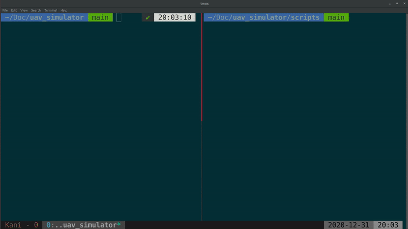

# Python - Gazebo Simulation Environment for a UAV with Geometric Control

This repository include Python codes for the position control a UAV in a Gazebo simulation environment, using [geometric controllers](https://github.com/fdcl-gwu/uav_geometric_control).


## Dependencies
1. [ROS](http://wiki.ros.org/): this repository has been developed using ROS Melodic, on Ubuntu 18.04.
1. Python GTK libraries for GUI (not required if you opt to not to use the GUI)
    ```sh
    sudo apt-get install python-gtk2-dev
    ```
1. Python modules: these libraries must be installed in the system
    1. NumPy
    1. Pandas
    1. Matplotlib

## Setting-up the Repository
1. Clone the repositroy.
    ```sh
    git clone https://github.com/fdcl-gwu/uav_simulator.git
    ```
1. Update the submodules.
    ```sh
    cd uav_simulator
    git submodule update --init --recursive
    ```

## Setting-up the Plugins and Gazebo
You only need to do the followings once (unless you change the Gazebo plugins)
1. Make the pluging.
    ```sh
    cd uav_simulator
    catkin_make
    ```
1. Source the relevant directories (**NOTE**: you need to do this on every new terminal).
    ```sh
    cd uav_simulator
    cd devel && source setup.bash && cd ../
    ```

## 
1. In the current terminal window, launch the Gazebo environment:
    ```sh
    roslaunch uav_gazebo simple_world.launch 
    ```
1. Once the Gazebo is launched, run the rover code from a different rover terminal (if you already don't know, you may find [**tmux**](https://github.com/tmux/tmux/wiki) a life-saver):
    ```sh
    python main.py
    ```
    If you change the Python code, simply re-run the Python code



## Tips
1. Everytime you change the simulation environment, you have to kill the program, `catkin_make` and re-run it. 
1. If you do not make any changes to the simulation environment, you only need to kill the Python program. 
1. The UAV will re-spawn at the position and orientation defined in `reset_uav()` in `rover.py` when you run the Python code.